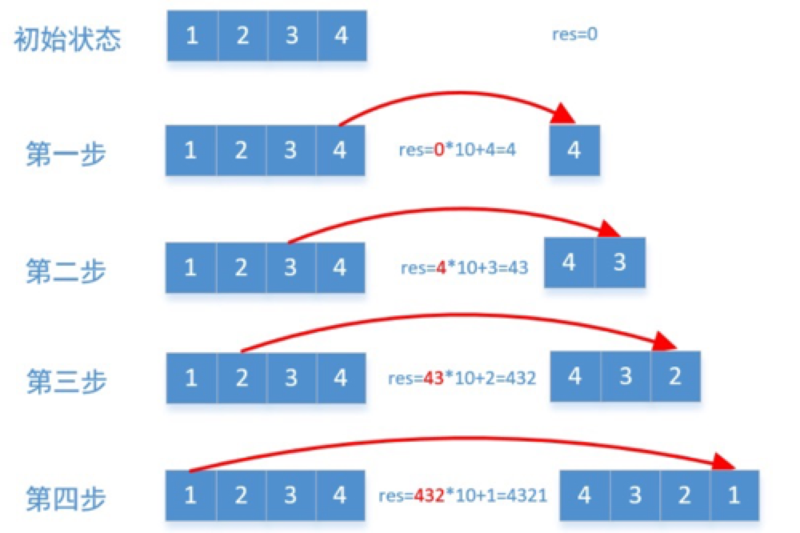

# 整数反转

## 描述

给你一个 32 位的有符号整数 x ，返回将 x 中的数字部分反转后的结果。

如果反转后整数超过 32 位的有符号整数的范围 [−231,  231 − 1] ，就返回 0。

假设环境不允许存储 64 位整数（有符号或无符号）。
 

**示例 1：**
```
输入：x = 123
输出：321
```

**示例 2：**

```
输入：x = -123
输出：-321
```

**示例 3：**

```
输入：x = 120
输出：21
```

**示例 4：**

```
输入：x = 0
输出：0
```

**提示：**

```
-2^31 <= x <= 2^31 - 1
```

## 相关标签

数学

## 解题

### 1. 数学解法

**思路：**

1. 关键点获取数值最后一位`x % 10`，去除数值最后一位`x / 10`；
2. 循环获取数值最后一位，每次 `res = i * 10 + x % 10`， 并`x = x / 10`；
3. 每次循环，判断 res 是否满足 `-2^31 <= x <= 2^31 - 1`， 不满足则返回0；
4. 直到循环判断 x === 0，结束循环，返回结果；



**复杂度分析：**

时间复杂度：O(log∣x∣)。翻转的次数即 x 十进制的位数。

空间复杂度：O(1)。

```js
/**
 * @param {number} x
 * @return {number}
 */
var reverse = function(x) {
let res = 0;
  const MAX_VALUE = Math.pow(2, 31) - 1;
  const MIN_VALUE = Math.pow(-2, 31);

  while (x != 0) {
    res = res * 10 + x % 10;

    if (res > MAX_VALUE || res < MIN_VALUE) {
        return 0
    };

    x = parseInt(x / 10);
  }

  return res;
};
```
