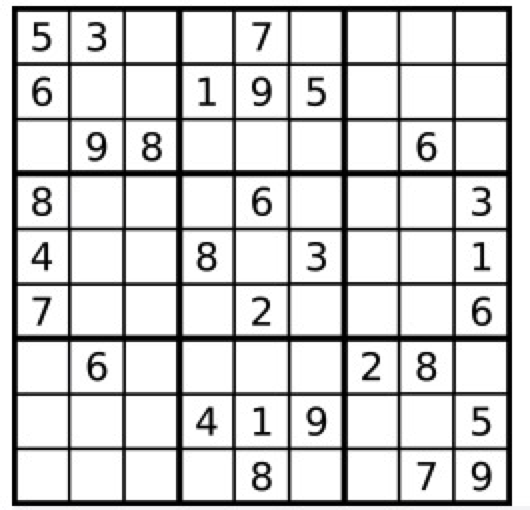

# 有效的数独

## 描述

请你判断一个  9 x 9 的数独是否有效。只需要 根据以下规则 ，验证已经填入的数字是否有效即可。

1. 数字  1-9  在每一行只能出现一次。
2. 数字  1-9  在每一列只能出现一次。
3. 数字  1-9  在每一个以粗实线分隔的  3x3  宫内只能出现一次。（请参考示例图）


**注意：**

一个有效的数独（部分已被填充）不一定是可解的。
只需要根据以上规则，验证已经填入的数字是否有效即可。
空白格用  `'.'`  表示。


**示例 1：**



```
输入：board =
[["5","3",".",".","7",".",".",".","."]
,["6",".",".","1","9","5",".",".","."]
,[".","9","8",".",".",".",".","6","."]
,["8",".",".",".","6",".",".",".","3"]
,["4",".",".","8",".","3",".",".","1"]
,["7",".",".",".","2",".",".",".","6"]
,[".","6",".",".",".",".","2","8","."]
,[".",".",".","4","1","9",".",".","5"]
,[".",".",".",".","8",".",".","7","9"]]
输出：true
```

**示例 2：**

```
输入：board =
[["8","3",".",".","7",".",".",".","."]
,["6",".",".","1","9","5",".",".","."]
,[".","9","8",".",".",".",".","6","."]
,["8",".",".",".","6",".",".",".","3"]
,["4",".",".","8",".","3",".",".","1"]
,["7",".",".",".","2",".",".",".","6"]
,[".","6",".",".",".",".","2","8","."]
,[".",".",".","4","1","9",".",".","5"]
,[".",".",".",".","8",".",".","7","9"]]
输出：false
解释：除了第一行的第一个数字从 5 改为 8 以外，空格内其他数字均与 示例1 相同。
但由于位于左上角的 3x3 宫内有两个 8 存在, 因此这个数独是无效的。
```

**提示：**

```
board.length == 9
board[i].length == 9
board[i][j] 是一位数字（1-9）或者 '.'
```

## 相关标签

数组，哈希表，矩阵

## 解题

### 1. 一次遍历解法

**思路：**

有效的数独满足以下三个条件：

1. 同一个数字在每一行只能出现一次；

2. 同一个数字在每一列只能出现一次；

3. 同一个数字在每一个小九宫格只能出现一次。

可以使用哈希表记录每一行、每一列和每一个小九宫格中，每个数字出现的次数。只需要遍历数独一次，在遍历的过程中更新哈希表中的计数（累加），并判断是否满足有效的数独的条件（累加小于 1）即可。

**复杂度分析：**

时间复杂度：O(1)。数独共有 8181 个单元格，只需要对每个单元格遍历一次即可。

空间复杂度：O(1)。由于数独的大小固定，因此哈希表的空间也是固定的。

```js
/**
 * @param {character[][]} board
 * @return {boolean}
 */
var isValidSudoku = function (board) {
  const rows = new Array(9).fill(0).map(() => new Array(9).fill(0));
  const columns = new Array(9).fill(0).map(() => new Array(9).fill(0));
  const subboxes = new Array(3)
    .fill(0)
    .map(() => new Array(3).fill(0).map(() => new Array(9).fill(0)));
  for (let i = 0; i < 9; i++) {
    for (let j = 0; j < 9; j++) {
      const value = board[i][j];
      if (value !== ".") {
        const index = value - "0" - 1;
        const row = ++rows[i][index];
        const column = ++columns[j][index];
        const subbox = ++subboxes[Math.floor(i / 3)][Math.floor(j / 3)][index];
        if (row > 1 || column > 1 || subbox > 1) {
          return false;
        }
      }
    }
  }
  return true;
};
```
