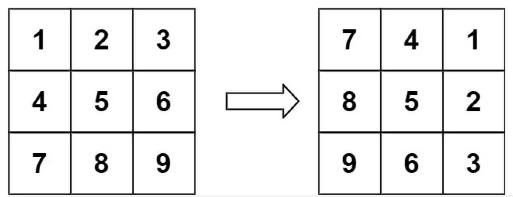
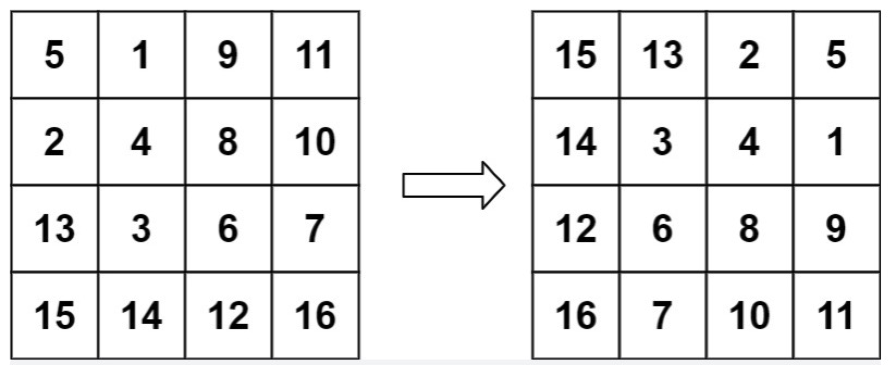

# 旋转图像

## 描述

给定一个 n × n 的二维矩阵 matrix 表示一个图像。请你将图像顺时针旋转 90 度。

你必须在 **原地** 旋转图像，这意味着你需要直接修改输入的二维矩阵。请不要 使用另一个矩阵来旋转图像。


**示例 1：**



```
输入：matrix = [[1,2,3],[4,5,6],[7,8,9]]
输出：[[7,4,1],[8,5,2],[9,6,3]]
```

**示例 2：**



```
输入：matrix = [[5,1,9,11],[2,4,8,10],[13,3,6,7],[15,14,12,16]]
输出：[[15,13,2,5],[14,3,4,1],[12,6,8,9],[16,7,10,11]]
```

**示例 3：**

```
输入：matrix = [[1]]
输出：[[1]]
```

**示例 4：**

```
输入：matrix = [[1,2],[3,4]]
输出：[[3,1],[4,2]]
```

**提示：**

```
matrix.length == n
matrix[i].length == n
1 <= n <= 20
-1000 <= matrix[i][j] <= 1000
```


## 相关标签

数组，数学，矩阵

## 解题

### 1. 翻转解法

**思路：**

先上下交换，在对角线交换

**复杂度分析：**

时间复杂度：O(N^2)，其中 N 是 matrix 的边长。对于每一次翻转操作，我们都需要枚举矩阵中一半的元素。

空间复杂度：O(1)。为原地翻转得到的原地旋转。


```js
/**
 * @param {number[][]} matrix
 * @return {void} Do not return anything, modify matrix in-place instead.
 */
var rotate = function(matrix) {
        const length = matrix.length
         // 水平翻转
        for(let i = 0; i < length/2; i++) {
            const temp = matrix[i]
            matrix[i] = matrix[length - 1 - i]
             matrix[length - 1 - i] = temp
        }
         // 主对角线翻转
        for(let i = 0; i < length; i++) {
            for(let j = i + 1; j < length; j++) {
                const temp = matrix[i][j]
                matrix[i][j] = matrix[j][i]
                matrix[j][i] = temp
            }
        }
        return matrix
};
```

### 2. 原地旋转解法

**思路：**

// TODO
`newMatrix[col][n−row−1] = matrix[row][col]`

**复杂度分析：**

时间复杂度：O(N^2)

空间复杂度：O(1)

```js

```