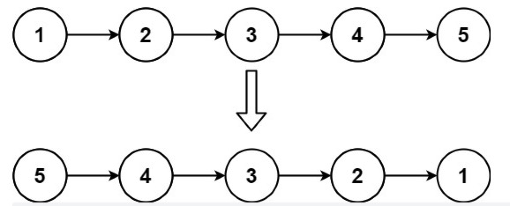
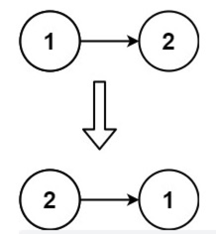

# 反转链表

## 描述

给你单链表的头节点 head ，请你反转链表，并返回反转后的链表。

**示例 1：**


```
输入：head = [1,2,3,4,5]
输出：[5,4,3,2,1]
```

**示例 2：**


```
输入：head = [1,2]
输出：[2,1]
```

**示例 3：**

```
输入：head = []
输出：[]
```

**提示：**

```
链表中节点的数目范围是 [0, 5000]
-5000 <= Node.val <= 5000
```

**进阶**：链表可以选用迭代或递归方式完成反转。你能否用两种方法解决这道题？

## 相关标签

递归、链表

## 解题

### 1. 迭代方法

**思路：**

把原链表的结点一个个摘掉，每次摘掉的链表都让他成为新的链表的头结点，然后更新新链表。

步骤：

1. 在遍历链表时，将当前节点的 next 指针改为指向前一个节点。
2. 由于节点没有引用其前一个节点，因此必须事先存储其前一个节点。
3. 在更改引用之前，还需要存储后一个节点。最后返回新的头引用。

**复杂度分析：**

时间复杂度：O(n)，其中 n 是链表的长度。需要遍历链表一次。

空间复杂度：O(1)。

```js
/**
 * Definition for singly-linked list.
 * function ListNode(val, next) {
 *     this.val = (val===undefined ? 0 : val)
 *     this.next = (next===undefined ? null : next)
 * }
 */
/**
 * @param {ListNode} head
 * @return {ListNode}
 */
var reverseList = function(head) {
    let newHead = null
    while(head !== null) {
        let temp = head.next
        head.next = newHead
        newHead = head
        head = temp
    }
    return newHead
};
```

### 2. 递归方法

**思路：**

先递归访问到底层(最后)把尾部找出来；

其它层在回退时head.next.next 指向当前层，实现反转；

同时当前层head.next=null，断开当前层指向下一层；

**复杂度分析：**

时间复杂度：O(n)，其中 n 是链表的长度。需要对链表的每个节点进行反转操作。

空间复杂度：O(n)，其中 n 是链表的长度。空间复杂度主要取决于递归调用的栈空间，最多为 n 层。

```js
/**
 * Definition for singly-linked list.
 * function ListNode(val, next) {
 *     this.val = (val===undefined ? 0 : val)
 *     this.next = (next===undefined ? null : next)
 * }
 */
/**
 * @param {ListNode} head
 * @return {ListNode}
 */
var reverseList = function(head) {
    if(!head || head.next === null) {
        return head
    }
    // 递归传入下一个节点，目的是为了到达最后一个节点
    const newHead = reverseList(head.next)
       /*
            第一轮出栈，head为5，head.next为空，返回5
            第二轮出栈，head为4，head.next为5，执行head.next.next=head也就是5.next=4，
                       把当前节点的子节点的子节点指向当前节点
                      此时链表为1->2->3->4<->5，由于4与5互相指向，所以此处要断开4.next=null
                      此时链表为1->2->3->4<-5
                      返回节点5
            第三轮出栈，head为3，head.next为4，执行head.next.next=head也就是4.next=3，
                      此时链表为1->2->3<->4<-5，由于3与4互相指向，所以此处要断开3.next=null
                      此时链表为1->2->3<-4<-5
                      返回节点5
            第四轮出栈，head为2，head.next为3，执行head.next.next=head也就是3.next=2，
                      此时链表为1->2<->3<-4<-5，由于2与3互相指向，所以此处要断开2.next=null
                      此时链表为1->2<-3<-4<-5
                      返回节点5
            第五轮出栈，head为1，head.next为2，执行head.next.next=head也就是2.next=1，
                      此时链表为1<->2<-3<-4<-5，由于1与2互相指向，所以此处要断开1.next=null
                      此时链表为1<-2<-3<-4<-5
                      返回节点5
            出栈完成，最终头节点5->4->3->2->1
         */
    head.next.next = head
    head.next = null
    return newHead
};
```
