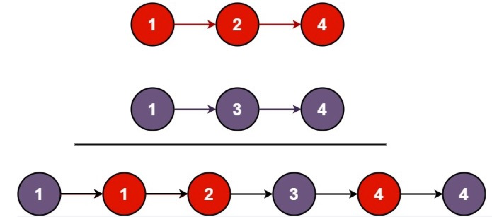

# 合并两个有序链表

## 描述

将两个升序链表合并为一个新的 升序 链表并返回。新链表是通过拼接给定的两个链表的所有节点组成的。 

 
**示例 1：**



```
输入：l1 = [1,2,4], l2 = [1,3,4]
输出：[1,1,2,3,4,4]
```

**示例 2：**

```
输入：l1 = [], l2 = []
输出：[]
```

**示例 3：**

```
输入：l1 = [], l2 = [0]
输出：[0]
```

**提示：**

```
两个链表的节点数目范围是 [0, 50]
-100 <= Node.val <= 100
l1 和 l2 均按 非递减顺序 排列
```

## 相关标签

递归、链表

## 解题

### 1. 顺序遍历，逐个比较方法

**思路：**

当 l1 和 l2 都不是空链表时，判断 l1 和 l2 哪一个链表的头节点的值更小，将较小值的节点添加到结果里，当一个节点被添加到结果里之后，将对应链表中的节点向后移一位。


**复杂度分析：**

* 时间复杂度：O(n + m)，其中 n 和 m 分别为两个链表的长度。因为每次循环迭代中，l1 和 l2 只有一个元素会被放进合并链表中， 因此 while 循环的次数不会超过两个链表的长度之和。所有其他操作的时间复杂度都是常数级别的，因此总的时间复杂度为 O(n+m)。

* 空间复杂度：O(1)。我们只需要常数的空间存放若干变量。

```js
/**
 * Definition for singly-linked list.
 * function ListNode(val, next) {
 *     this.val = (val===undefined ? 0 : val)
 *     this.next = (next===undefined ? null : next)
 * }
 */
/**
 * @param {ListNode} list1
 * @param {ListNode} list2
 * @return {ListNode}
 */
var mergeTwoLists = function(list1, list2) {
    if(list1 === null) {
        return list2
    }
    if(list2 === null) {
        return list1
    }
    // 设定哨兵节点, 可以在最后让我们比较容易地返回合并后的链表
    const dummy = new ListNode(0)
    let temp = dummy
    while(list1  && list2 ) {
        if(list1.val <= list2.val) {
            temp.next = list1
            list1 = list1.next
        } else {
            temp.next = list2
            list2 = list2.next
        }
        temp = temp.next
    }
    // 然后把那个不为空的链表挂到新的链表中
    temp.next = list1 == null ? list2 : list1;
    return dummy.next
};
```

### 2. 递归方法

**思路：**

这道题可以使用递归实现，新链表也不需要构造新节点，我们下面列举递归三个要素：

* 终止条件：两条链表分别名为 l1 和 l2，当 l1 为空或 l2 为空时结束；
* 返回值：每一层调用都返回排序好的链表头；
* 本级递归内容：如果 l1 的 val 值更小，则将 l1.next 与排序好的链表头相接，l2 同理
O(m+n)，m 为 l1的长度，n 为 l2 的长度；


**复杂度分析：**

* 时间复杂度：O(n+m)，其中 n 和 m 分别为两个链表的长度。因为每次调用递归都会去掉 l1 或者 l2 的头节点（直到至少有一个链表为空），函数 mergeTwoList 至多只会递归调用每个节点一次。因此，时间复杂度取决于合并后的链表长度，即 O(n+m)。

* 空间复杂度：O(n+m)，其中 n 和 m 分别为两个链表的长度。递归调用 mergeTwoLists 函数时需要消耗栈空间，栈空间的大小取决于递归调用的深度。结束递归调用时 mergeTwoLists 函数最多调用 n+m 次，因此空间复杂度为 O(n+m)。


```js
var mergeTwoLists = function(list1, list2) {
    if(list1 === null) {
        return list2
    }
    if(list2 === null) {
        return list1
    }
    if(list1.val < list2.val) {
      list1.next = mergeTwoLists(list1.next, list2)
      return list1
    } else {
       list2.next = mergeTwoLists(list1, list2.next)
       return list2
    }
}
```
