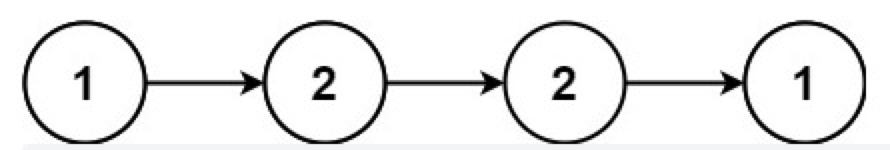
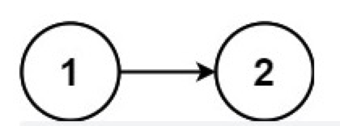

# 回文链表

## 描述

给你一个单链表的头节点 `head` ，请你判断该链表是否为回文链表。如果是，返回 `true` ；否则，返回 `false` 。


**示例 1：**



```
输入：head = [1,2,2,1]
输出：true
```

**示例 2：**



```
输入：head = [1,2]
输出：false
```

**提示：**

```
链表中节点数目在范围[1, 105] 内
0 <= Node.val <= 9
```

**进阶：** 你能否用 O(n) 时间复杂度和 O(1) 空间复杂度解决此题？

## 相关标签

栈、递归、链表、双指针

## 解题

### 1. 快慢指针方法

**思路：**

1. 先找到链表中点；
2. 反转链表中点之后的链表；
3. 循环反转链表 同 链表 进行比较值是否相等，判断回文；
4. 恢复链表；
5. 输出结果；

**复杂度分析：**

时间复杂度：O(n)，其中 n 指的是链表的大小。

空间复杂度：O(1)。我们只会修改原本链表中节点的指向，而在堆栈上的堆栈帧不超过 O(1)。


```js
// 翻转列表
const reverseList = (head) => {
    let prev = null;
    let curr = head;
    while (curr !== null) {
        let nextTemp = curr.next;
        curr.next = prev;
        prev = curr;
        curr = nextTemp;
    }
    return prev;
}

// 获取链表中点
const endOfFirstHalf = (head) => {
    let fast = head;
    let slow = head;
    while (fast.next !== null && fast.next.next !== null) {
        fast = fast.next.next;
        slow = slow.next;
    }
    return slow;
}

var isPalindrome = function(head) {
    if (head == null) return true;

    // 找到前半部分链表的尾节点并反转后半部分链表
    const firstHalfEnd = endOfFirstHalf(head);
    const secondHalfStart = reverseList(firstHalfEnd.next);

    // 判断是否回文
    let p1 = head;
    let p2 = secondHalfStart;
    // let result = true;
    while (p2 != null) {
        // if (p1.val != p2.val) result = false;
          if (p1.val != p2.val) return false;
        p1 = p1.next;
        p2 = p2.next;
    }        

    // 还原链表并返回结果
    firstHalfEnd.next = reverseList(secondHalfStart);
    // return result;
    return true
};
```

### 2. 栈/数组方法

**思路：**

1. 将链表循环，结点值推入数组中；
2. 双指针法判断是否回文。

**复杂度分析：**

* 时间复杂度：O(n)，其中 n 指的是链表的元素个数。
  * 第一步： 遍历链表并将值复制到数组中，O(n)。
  * 第二步：双指针判断是否为回文，执行了 O(n/2) 次的判断，O(n)。
  * 总的时间复杂度：O(2n)=O(n)。
* 空间复杂度：O(n)，其中 n 指的是链表的元素个数，我们使用了一个数组列表存放链表的元素值。


```js
var isPalindrome = function(head) {
  if (head === null) {
      return true;
  }

  const arr = []
  while(head !== null) {
    arr.push(head.val)
    head = head.next
  }

  for(let i = 0, j = arr.length -1; i<j; i++, j--) {
    if(arr[i] !== arr[j]) {
      return false
    }
  }

  return true
}
```

// TODO
### 3. 递归方法

**思路：**

**复杂度分析：**

```js

```
