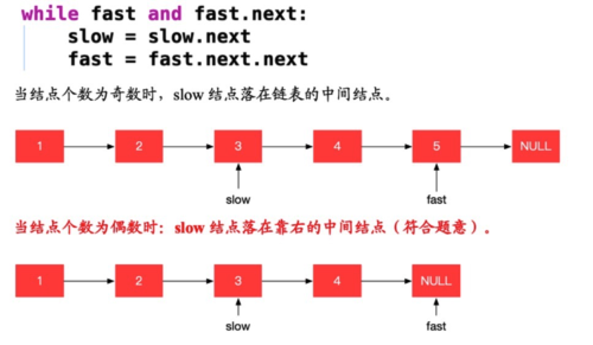
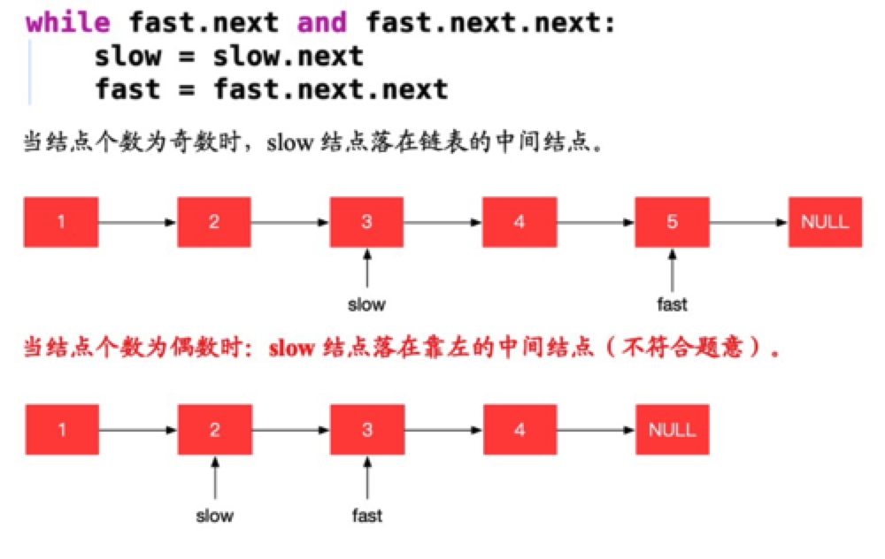

# 链表的中间结点

## 描述

给定一个头结点为 head 的非空单链表，返回链表的中间结点。

如果有两个中间结点，则返回第二个中间结点。

 

**示例 1：**

```
输入：[1,2,3,4,5]
输出：此列表中的结点 3 (序列化形式：[3,4,5])
返回的结点值为 3 。 (测评系统对该结点序列化表述是 [3,4,5])。
注意，我们返回了一个 ListNode 类型的对象 ans，这样：
ans.val = 3, ans.next.val = 4, ans.next.next.val = 5, 以及 ans.next.next.next = NULL.
```
**示例 2：**

```
输入：[1,2,3,4,5,6]
输出：此列表中的结点 4 (序列化形式：[4,5,6])
由于该列表有两个中间结点，值分别为 3 和 4，我们返回第二个结点。
```

**提示：**

* 给定链表的结点数介于 `1` 和 `100` 之间。


## 相关标签

链表、快慢指针

## 解题

### 1. 快慢指针方法

**思路：**

两个指针，循环，慢指针走一步，快指针走两步。

那么当 fast 到达链表的末尾时，slow 必然位于中间。

**复杂度分析：**

时间复杂度：O(N)，其中 N 是给定链表的结点数目。

空间复杂度：O(1)，只需要常数空间存放 slow 和 fast 两个指针。

1. 情况1：如果快指针可以前进的条件是：当前快指针和当前快指针的下一个节点都非空。

    **注意：** 按照情况1实现，当结点个数为奇数时，需要判断快指针节点是否为真，为真则将慢指针指向当前慢指针的下一个结点。如下代码所示：

    ```js
    // 如果fast不为空，说明链表的长度是奇数个
    if(fast !== null) {
        show = show.next
    }
    ```

    

    代码如下：

    ```js
    /**
    * Definition for singly-linked list.
    * function ListNode(val, next) {
    *     this.val = (val===undefined ? 0 : val)
    *     this.next = (next===undefined ? null : next)
    * }
    */
    /**
    * @param {ListNode} head
    * @return {ListNode}
    */
    var middleNode = function(head) {
        let slow = head;
        let fast = head;
        while (fast && fast.next) {
            slow = slow.next;
            fast = fast.next.next;
        }
        return slow;
    };
    ```
2. 情况2：如果快指针可以前进的条件是：当前指针的下一个结点和下下个结点都非空。

   **注意：** 按照情况2实现，处理中点后续操作，**统一指向慢指针的下一个结点**。

    

      代码如下：

    ```js
      /**
      * Definition for singly-linked list.
      * function ListNode(val, next) {
      *     this.val = (val===undefined ? 0 : val)
      *     this.next = (next===undefined ? null : next)
      * }
      */
      /**
      * @param {ListNode} head
      * @return {ListNode}
      */
      const middleNode = (head) => {
          let fast = head;
          let slow = head;
          while (fast.next !== null && fast.next.next !== null) {
              fast = fast.next.next;
              slow = slow.next;
          }
          return slow;
      }
    ```

### 2. 数组方法

**思路：**

对链表进行遍历，同时将遍历到的元素依次放入数组 A 中。

如果我们遍历到了 N 个元素，那么链表以及数组的长度也为 N，对应的中间节点即为 A[N/2]。


**复杂度分析：**

时间复杂度：O(N)，其中 N 是给定链表中的结点数目。

空间复杂度：O(N)，即数组 A 用去的空间。

```js
var middleNode = function(head) {
    let A = [head];
    while (A[A.length - 1].next != null) {
      A.push(A[A.length - 1].next);
    }
    return A[Math.trunc(A.length / 2)];
};
```
