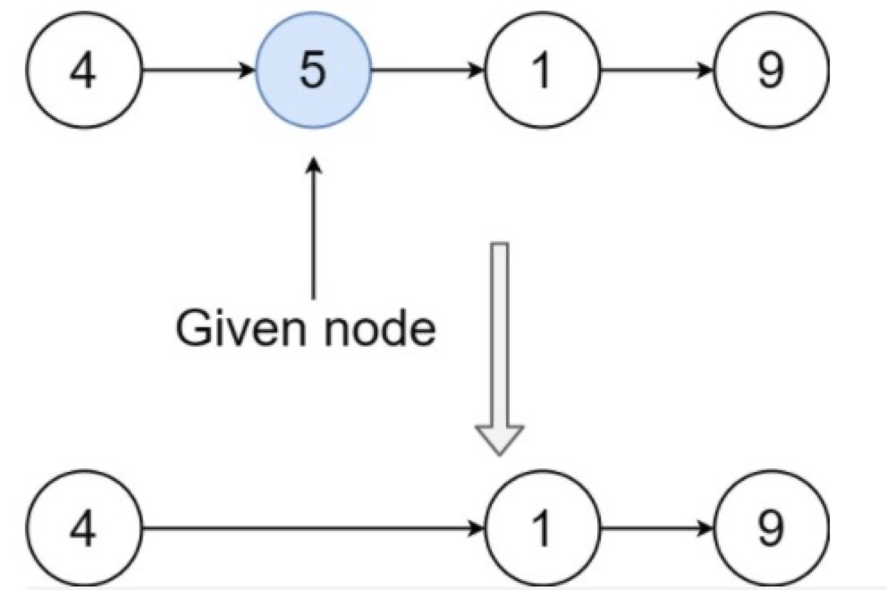
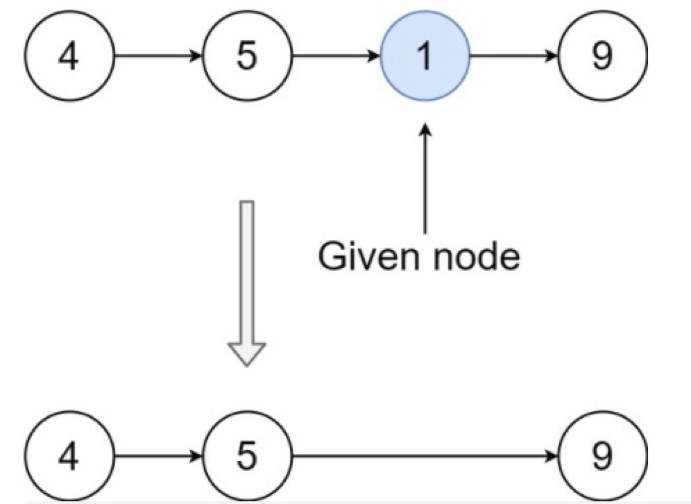

# 删除链表中的节点

## 描述

请编写一个函数，用于 **删除单链表中某个特定节点** 。在设计函数时需要注意，你无法访问链表的头节点 `head` ，只能直接访问 **要被删除的节点**。

题目数据保证需要删除的节点 **不是末尾节点** 。

 
**示例 1：**


```
输入：head = [4,5,1,9], node = 5
输出：[4,1,9]
解释：指定链表中值为 5 的第二个节点，那么在调用了你的函数之后，该链表应变为 4 -> 1 -> 9
```
**示例 2：**

```
输入：head = [4,5,1,9], node = 1
输出：[4,5,9]
解释：指定链表中值为 1 的第三个节点，那么在调用了你的函数之后，该链表应变为 4 -> 5 -> 9
```
**示例 3：**

```
输入：head = [1,2,3,4], node = 3
输出：[1,2,4]
```

**示例 4：**

```
输入：head = [0,1], node = 0
输出：[1]
```

**示例 5：**

```
输入：head = [-3,5,-99], node = -3
输出：[5,-99]
```

**提示：**

```
链表中节点的数目范围是 [2, 1000]
-1000 <= Node.val <= 1000
链表中每个节点的值都是唯一的
需要删除的节点 node 是 链表中的一个有效节点 ，且 不是末尾节点
```
## 相关标签

链表
## 解题

### 1. 和下一个节点交换解法

**思路：**

删除链表中的节点的**常见的方法**：

定位到待删除节点的上一个节点，修改上一个节点的 `next` 指针，使其指向待删除节点的下一个节点，即可完成删除操作。

这道题中，因为是单链表，传入的参数 `node` 为要被删除的节点，无法定位到该节点的上一个节点。注意到要被删除的节点不是链表的末尾节点，因此 `node.next` 不为空，可以通过对 `node` 和 `node.next` 进行操作实现删除节点。

解题主要原则：***移形换位***

将当前节点的值 和 下一个指向 替换成 下一个节点的值 和 下一个指向。

步骤：

* 把当前节点的下一个指向（next）的值 转到当前节点；
* 然后再把当前节点的next的next地址转移到当前节点；
* 也就是鸠占鹊巢，吃你的东西还要占有你的房子，你就被赶跑了，也就是删除了

**复杂度分析：**

时间复杂度：O(1)。

空间复杂度：O(1)。

```js
/**
 * Definition for singly-linked list.
 * function ListNode(val) {
 *     this.val = val;
 *     this.next = null;
 * }
 */
/**
 * @param {ListNode} node
 * @return {void} Do not return anything, modify node in-place instead.
 */
var deleteNode = function(node) {
    node.val = node.next.val
    node.next = node.next.next
};
```
